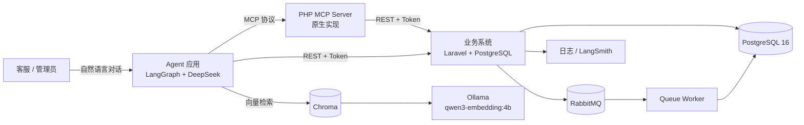
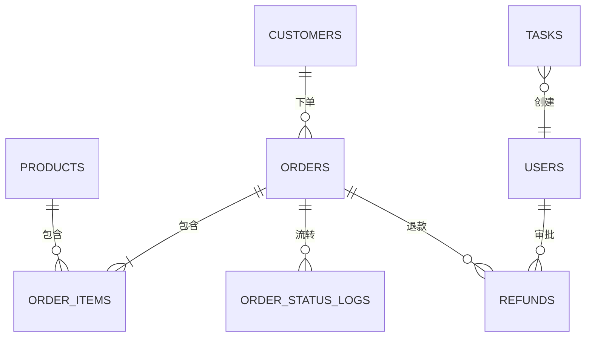
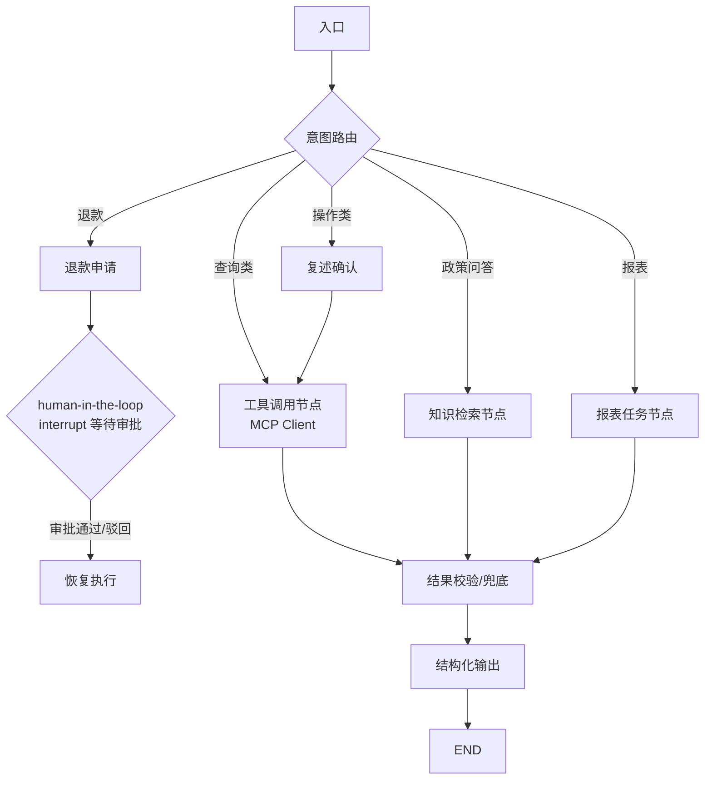
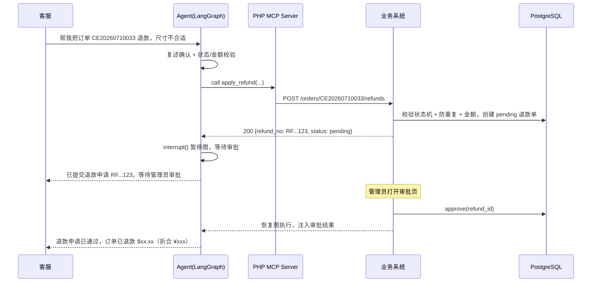
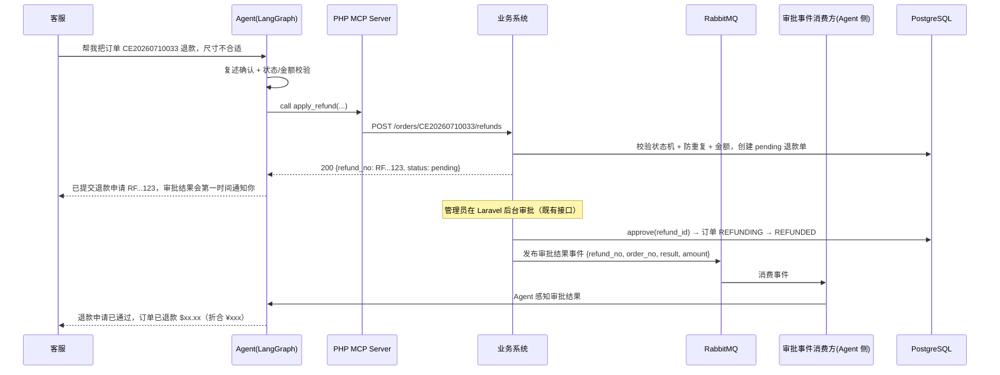
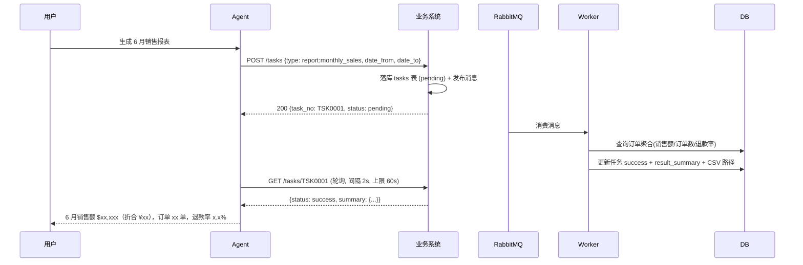
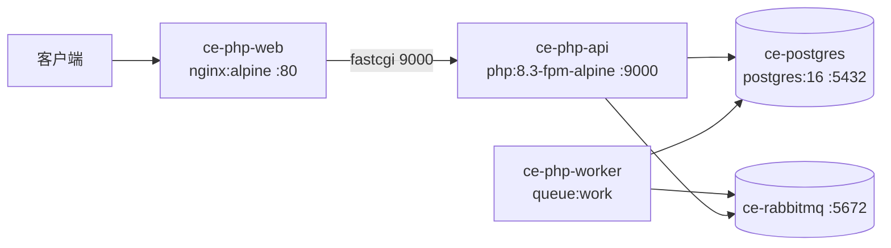

# 跨境电商智能订单助手 — 架构文档

| 项目名 | cross-ecommerce-agent |
|-----|-----------------------|
| 版本  | v1.0                  |
| 日期  | 2026-08-24            |

---

## 1. 总体架构



**核心思想：三层解耦。**

1. **Agent 层**（Python/LangGraph）：只负责对话、规划、工具编排，不直接碰数据库
2. **工具层**（PHP MCP Server）：把业务 API 包装成标准协议工具，Agent 框架可替换
3. **业务层**（Laravel）：数据与流程的唯一事实来源（Single Source of Truth），所有写操作在这里校验

---

## 2. 设计原则

| 原则         | 说明                                         |
|------------|--------------------------------------------|
| 业务系统不感知 AI | 业务 API 不知道调用方是 LLM，保证可独立测试、独立演进            |
| Agent 无特权  | 所有操作走业务校验（状态机），Agent 只是"更聪明的调用者"           |
| 写操作必须人工兜底  | 退款等资金操作强制 human-in-the-loop                |
| 异步优先       | 慢操作（>2s）一律入队，绝不阻塞 LLM 调用（LLM 超时 10s 内必须响应） |
| 标准优先       | 工具层用 MCP 协议，将来换 Agent 框架/模型零改造             |
| 快照保真       | 金额、汇率、地址在订单上留快照，历史数据不可漂移                   |

---

## 3. 技术选型

| 组件        | 技术                                  | 理由                               |
|-----------|-------------------------------------|----------------------------------|
| 业务系统      | PHP 8.3 + Laravel 11                | 开发效率高；迁移/Seeder/中间件/队列生态齐全       |
| 数据库       | PostgreSQL 16                       | 事务（库存、退款）、关系查询                   |
| 消息队列      | RabbitMQ + php-amqplib              | 异步任务解耦；熟悉的库，可手写 Worker 展示功底      |
| Agent 编排  | Python 3.11 + LangGraph + LangChain | 多代理图编排、interrupt、状态管理            |
| 主力 LLM    | DeepSeek API                        | 成本低、中文好、工具调用稳定                   |
| Embedding | Ollama qwen3-embedding:4b（本地）       | 隐私、零 API 成本、简历可写"本地化部署"          |
| 向量库       | Chroma                              | 轻量、开箱即用，够演示                      |
| 工具协议      | MCP（原生 PHP 实现）                      | 2026 年 Agent 工具标准；PHP 生态稀缺，差异化亮点 |
| 追踪/评测     | LangSmith（可选）                       | Agent 可观测性                       |
| 部署        | 本地环境（Windows 原生服务 + 进程）             | 见 §10 本地部署方案，免 Docker            |
| 审批端       | Laravel Blade 单页                    | 极简，仅审批列表 + 通过/驳回按钮               |

**为什么不用 Dify**：低代码平台隐藏了向量库、检索、编排细节；纯代码实现更能体现工程能力（评估过，最终选择自研）。

---

## 4. 仓库结构

```
cross-ecommerce-agent/
├── business-system/            # Laravel 业务系统
│   ├── app/
│   │   ├── Modules/
│   │   │   ├── Order/          # 订单（含状态机）
│   │   │   ├── Product/        # 商品与库存
│   │   │   ├── Customer/       # 客户（含脱敏）
│   │   │   ├── Refund/         # 退款与审批
│   │   │   └── Task/           # 异步任务
│   │   └── Support/            # 统一响应、错误码、鉴权中间件
│   ├── database/
│   │   ├── migrations/
│   │   └── seeders/            # 造数脚本（100+ 订单）
│   ├── routes/api.php
│   └── docker/php/
├── agent/                      # LangGraph 应用
│   ├── graph/                  # 节点、边、状态定义
│   ├── nodes/                  # 路由 / 工具 / RAG / 报表 节点
│   ├── tools/                  # 工具定义（名称、描述、参数 schema）
│   ├── rag/                    # 文档分块、embedding、检索、重排
│   └── prompts/                # 系统提示词
├── mcp-server/                 # 原生 PHP MCP Server（无框架）
├── docs/                       # PRD.md / ARCHITECTURE.md（本文件）
├── eval/                       # 评测用例 + 评测脚本
└── deploy/                     # 本地启动/停止脚本（start-all.bat / stop-all.bat）
```

---

## 5. 数据模型

### 5.1 ER 概览



### 5.2 表结构（关键字段）

**users**（客服/管理员）
`id, name, email, password_hash, role(agent_caller|admin), created_at`

**customers**
`id, email, name, phone, country, currency, total_spent, created_at`

**products**
`id, sku(唯一), name, description, price, currency, stock, weight_kg, status(on|off), created_at`

**orders**
`id, order_no(唯一 CE+日期+序号), customer_id, status, currency, exchange_rate(快照), total_amount, paid_amount, shipping_address(json), tracking_no, logistics_status, paid_at, shipped_at, completed_at, created_at, updated_at`

**order_items**
`id, order_id, product_id, sku, name(快照), quantity, unit_price`

**order_status_logs**（审计）
`id, order_id, from_status, to_status, remark, operator(agent|admin:{id}), created_at`

**refunds**
`id, refund_no(唯一 RF+日期+序号), order_id, customer_id, amount, currency, reason, status(pending|approved|rejected), approver_id, approved_at, created_at`

**tasks**
`id, task_no(唯一 TSK+序号), type(report:monthly_sales|report:refund_rate|export:orders), params(json), status(pending|running|success|failed), result_summary(json), result_path, error, created_by, created_at, finished_at`

**exchange_rates**
`id, currency, rate_to_cny, updated_at`

> 说明：`order_items` 冗余 `sku/name` 快照，防止商品信息变更影响历史订单。

---

## 6. API 设计

### 6.1 通用约定

- Base URL：`/api/v1`
- 鉴权：请求头 `Authorization: Bearer <token>`，两套 token（`agent` 角色、`admin` 角色）
- 响应格式：`{ "code": 0, "message": "ok", "data": {...} }`
- 分页：`?page=1&page_size=20`，返回 `{ items, total, page, page_size }`

### 6.2 错误码表

| code  | 含义                    |
|-------|-----------------------|
| 0     | 成功                    |
| 4000x | 参数错误                  |
| 40100 | 未认证 / Token 无效        |
| 40300 | 无权限                   |
| 4040x | 资源不存在（订单/客户/商品/退款单）   |
| 4090x | 业务冲突（状态不允许、重复退款、库存不足） |
| 50000 | 服务器内部错误               |

### 6.3 端点清单

| 方法   | 路径                          | 说明              | 权限    | 超时    |
|------|-----------------------------|-----------------|-------|-------|
| GET  | /orders                     | 多条件查询订单         | agent | 500ms |
| GET  | /orders/{order_no}          | 订单详情（含时间线）      | agent | 500ms |
| POST | /orders                     | 下单（事务扣库存）       | agent | 1s    |
| PUT  | /orders/{order_no}/address  | 修改收货地址          | agent | 1s    |
| POST | /orders/{order_no}/cancel   | 取消订单            | agent | 1s    |
| GET  | /orders/{order_no}/tracking | 物流轨迹            | agent | 500ms |
| GET  | /products                   | 商品查询（SKU/关键词）   | agent | 500ms |
| GET  | /products/{sku}/stock       | 库存查询            | agent | 500ms |
| GET  | /customers/{id}             | 客户详情 + 消费统计（脱敏） | agent | 500ms |
| POST | /orders/{order_no}/refunds  | 申请退款 → pending  | agent | 1s    |
| GET  | /refunds                    | 退款单查询           | agent | 500ms |
| POST | /refunds/{id}/approve       | 审批通过            | admin | 1s    |
| POST | /refunds/{id}/reject        | 审批驳回            | admin | 1s    |
| POST | /tasks                      | 创建异步任务          | agent | 500ms |
| GET  | /tasks/{task_no}            | 轮询任务状态/结果       | agent | 500ms |
| GET  | /health                     | 健康检查            | 公开    | 200ms |

### 6.4 响应示例

```json
{
  "code": 0,
  "message": "ok",
  "data": {
    "order_no": "CE20260615001",
    "status": "SHIPPED",
    "currency": "USD",
    "exchange_rate": 7.12,
    "total_amount": 89.90,
    "paid_amount_cny": 640.09,
    "customer": { "id": 5, "name": "Alice M.", "country": "US" },
    "items": [{ "sku": "SKU-1001", "name": "Wireless Earbuds Pro", "quantity": 1, "unit_price": 89.90 }],
    "tracking_no": "SF1234567890",
    "logistics_status": "IN_CUSTOMS",
    "timeline": [
      { "status": "PAID", "at": "2026-06-15 10:22:00" },
      { "status": "SHIPPED", "at": "2026-06-16 09:00:00" }
    ]
  }
}
```

---

## 7. Agent 集成设计

### 7.1 工具清单（Agent 视角）

| 工具名                  | 描述（给 LLM）            | 参数                                                     | 对应 API                    |
|----------------------|----------------------|--------------------------------------------------------|---------------------------|
| query_order          | 按单号/客户/状态/日期查订单列表或详情 | order_no?, customer_id?, status?, date_from?, date_to? | GET /orders               |
| track_order          | 查询订单物流轨迹             | order_no                                               | GET /orders/{no}/tracking |
| query_product        | 查商品信息与库存             | sku?, keyword?                                         | GET /products             |
| query_customer       | 查客户信息与消费统计           | customer_id?, email?                                   | GET /customers/{id}       |
| update_order_address | 修改未发货订单的收货地址         | order_no, new_address                                  | PUT /orders/{no}/address  |
| apply_refund         | 提交退款申请（触发人工审批）       | order_no, reason, amount?                              | POST /orders/{no}/refunds |
| query_refund         | 查退款单状态               | refund_no?, order_no?, status?                         | GET /refunds              |
| ask_policy           | 售后政策知识问答（RAG）        | question                                               | 内部 RAG 检索                 |
| create_report        | 创建异步报表任务             | type, date_from, date_to                               | POST /tasks               |
| get_task_result      | 查询异步任务结果             | task_no                                                | GET /tasks/{no}           |

> 规则：**写操作工具（apply_refund / update_order_address / create_report）在 Agent 侧执行前必须向用户复述确认**；退款最终由 admin 审批兜底。

### 7.2 LangGraph 图设计



关键实现点：

- **状态定义**（TypedDict）：`messages`、`intent`、`tool_results`、`pending_refund`、`need_human`、`final_answer`
- **路由节点**：用结构化输出（JSON）做意图分类，四类：`query / operation / policy / report`
- **工具节点**：通过 MCP 客户端调用 PHP 业务工具，统一异常捕获（超时/409/404 → 转兜底话术）
- **interrupt 节点（方案 A / M3 过渡）**：`apply_refund` 成功后 `interrupt({"type": "refund_approve", "refund_no": ...})`，恢复时注入审批结果，继续生成最终答复；生产形态（方案 B）提交后不挂起，改由 RabbitMQ 审批事件驱动（见 7.3.1）
- **RAG 节点**：检索 Top-K 片段 → 重排 → 拼上下文 → DeepSeek 生成带引用的回答
- **兜底**：任何工具空结果/异常 → "未查到，建议换个条件"，绝不编造

### 7.3 退款审批时序（human-in-the-loop）



### 7.3.1 生产形态（方案 B）：事件驱动审批（2026-09-01 决策，已落地）

> ✅ **2026-09-01 已实现**：`RefundEventPublisher`（Laravel 审批后发布 `refund_events` 持久化队列）+ `agent/refund_consumer.py`（订阅事件异步通知）；Agent 提交退款后不再挂起（第二个 interrupt 已移除，第一个确认中断保留）。

> M3 先按 7.3（方案 A：interrupt 暂停/恢复）打通闭环；生产切换为事件驱动，避免进程长挂起与双重审批。



要点：

- **Agent 不 interrupt、不轮询**：提交退款后立即返回"已提交待审批"，审批结果由事件驱动，天然抗超时/重启
- **事件契约**：`{refund_no, order_no, result(approved|rejected), amount, currency, approved_at}`；队列持久化，失败重投，死信兜底
- **与方案 A 的衔接**：M3 的 interrupt payload 与方案 B 事件共用同一结构（至少包含 `refund_no`），后续切换只换"结果来源"（resume 注入 → 事件回调），图逻辑不变
- **审计**：审批动作仍由业务系统落库（`refunds.approver_id / approved_at`），Agent 侧只做消息通知，不重复审批

### 7.4 RAG 链路

```
售后政策文档(Markdown) 
  → 分块(按章节, 带元数据) 
  → Ollama qwen3-embedding:4b 向量化 
  → Chroma 存储
  → 查询: 问题向量化 → Top-K 检索 → 轻量重排(关键词/引用重叠加分)
  → DeepSeek 生成回答, 附引用来源(文档章节 + 原文片段)
```

### 7.5 会话记忆与上下文管理

**存储：PostgreSQL checkpointer（PostgresSaver + psycopg_pool 连接池）**

```
thread_id(会话) → checkpoints 表: 每次图节点执行后的完整 state 快照
                → checkpoint_writes 表: 各节点的增量写入(messages 等)
```

- 多轮对话：同一 `thread_id` 的多次 invoke，消息经 `add_messages` reducer 自动累积；不同 thread 隔离
- 中断恢复：human-in-the-loop（退款审批 interrupt）依赖 checkpointer 恢复挂起状态（见 7.3）
- 部署注意：setup() 含 `CREATE INDEX CONCURRENTLY`，须用 autocommit 独立连接建表；Agent 访问容器内 PG 用宿主映射端口

**上下文管理（LLM 输入裁剪）**

```
state["messages"] 全量持久化(checkpointer)  ← 记忆层, 不裁剪
        ↓
LLM 输入: [system] + [摘要?] + [最近 N 轮] + [当前问题]  ← 上下文层, 必裁剪
```

- **方案 A（截断）**：超过 `HISTORY_LIMIT`（默认 10 条 ≈ 5 轮）的旧消息不进入 LLM 输入，仅保留在 state
- **方案 B（摘要）**：历史超限时，由 LLM 将更早消息压缩为摘要（保留订单号、金额、用户诉求、未决事项），替代被截断部分进入上下文

```
伪代码: 
history = state["messages"]
if len(history) > LIMIT:
    old, recent = history[:-LIMIT], history[-LIMIT:]
    summary = llm.summarize(old)              # 方案 B: 旧消息 → 摘要
    context = [System, summary, *recent, Human(当前问题)]
else:
    context = [System, *history, Human(当前问题)]
```

- **摘要存储（后续）**：摘要可持久化（PG 表 / Redis），实现跨会话的长期记忆复用

---

## 8. 异步任务设计（RabbitMQ）



要点：

- 队列：`task_orders`（持久化），死信队列 `task_orders.dlq`
- Worker：Laravel 队列 Worker（`laravel-queue-rabbitmq` 驱动）或 php-amqplib 手写常驻进程
- 重试：失败重试 3 次（指数退避），仍失败 → `failed` + 记录错误原因
- 任务幂等：按 `task_no` 加唯一索引，重复消息不重复执行
- 审批结果事件（方案 B）：队列 `refund_events`（持久化）承载退款审批结果，Agent 订阅后异步回复用户，事件契约与触发时机见 §7.3.1

---

## 9. 安全设计

| 维度    | 措施                                                        |
|-------|-----------------------------------------------------------|
| 鉴权    | 双层 Token：Agent↔MCP、Agent↔业务系统 各自独立；admin 角色单独签发           |
| 审计    | 所有写操作（改地址/取消/退款/审批）写 `order_status_logs` 或审计表，记录 operator |
| 脱敏    | 客户手机号中间四位打码，接口与日志层统一处理                                    |
| 注入防护  | 工具参数严格校验（枚举/长度/类型）；系统提示词不拼接用户输入；用户输入只进"用户消息"槽位            |
| 超时与限流 | API 层超时兜底；工具调用 10s 超时；可选 Rate Limit 中间件                   |
| 数据安全  | 各服务绑定 127.0.0.1，业务 API 不暴露公网（演示除外）                        |

---

## 10. 部署方案（Docker Compose，现行）

生产式架构：**Nginx 容器（静态 + 反代）→ PHP-FPM 容器 → PostgreSQL**，队列 Worker 独立容器。



| 服务         | 镜像                           | 端口（宿主机）      | 说明                                                       |
|------------|------------------------------|--------------|----------------------------------------------------------|
| postgres   | postgres:16-alpine           | 5433         | 业务库（本机 5432 被原生 PG 占用故错开）                                |
| rabbitmq   | rabbitmq:3-management-alpine | 5673 / 15673 | 队列（M2 启用）                                                |
| php-web    | nginx:alpine                 | 8000         | 静态资源 + fastcgi 反代；配置 `business-system/docker/nginx.conf` |
| php-api    | 自建（php:8.3-fpm-alpine）       | 不对外          | 业务 API，默认命令 `php-fpm`                                    |
| php-worker | 同 php-api 镜像                 | —            | 队列 Worker（`queue:work`）                                  |

### 10.1 关键设计

- **开发模式挂载**：`./business-system:/var/www` bind mount，宿主机改代码即生效；`/var/www/vendor` 匿名卷保留镜像内依赖
- **entrypoint 自动化**：等库 → `migrate` → 空库自动 `db:seed`（120 订单演示数据）→ `exec` 主命令
- **PHP-FPM 环境**：`clear_env = no`（zz-env.conf）让 worker 继承容器环境变量
- **Nginx 必须项**：`fastcgi_param HTTP_AUTHORIZATION $http_authorization;` —— fastcgi_params 默认不传 Authorization 头，Bearer 鉴权会 401

### 10.2 常用命令

```bash
docker compose up -d --build   # 构建 + 启动
cd E:\cross-ecommerce-agent
curl.exe http://127.0.0.1:8000/api/v1/health

docker compose logs -f php-api     # 看 API 日志
docker compose exec php-api php artisan tinker   # 容器内调试
docker compose exec php-api php artisan migrate  # 新迁移
docker compose down -v             # 停止并清空数据卷（重新造数）
```

### 10.3 演示路径

`GET http://127.0.0.1:8000/api/v1/health` → `{code:0}` 即就绪；带 Token 调用订单/退款/任务接口，M3 接入 Agent 后走自然语言对话。

---

## 11. 可观测性与评测

- **日志**：业务 API 请求日志（method/path/status/耗时/trace_id）、状态流转日志、审批日志
- **Agent 追踪**：LangSmith 记录每次运行的节点耗时、工具调用、token 消耗
- **评测集**（`eval/` 目录）：
  - `cases.jsonl`：30+ 条用例（含期望结果与负向断言，见 PRD §9.2）
  - `run_eval.py`：逐条跑 Agent → 结构化断言（正确/错误/是否编造）→ 输出通过率报告
  - 关键指标：整体通过率 ≥ 90%，负向用例拦截率 100%

---

## 12. 演进方向（后续可写进简历的规划）

1. 接真实跨境平台 API（Amazon SP-API / Shopify）实现订单同步
2. 接真实物流商接口（17TRACK / 云途）替换模拟轨迹
3. WebSocket 推送任务完成事件（替代轮询）
4. 多租户与权限分级
5. 用 LangSmith 做在线评测与回归
