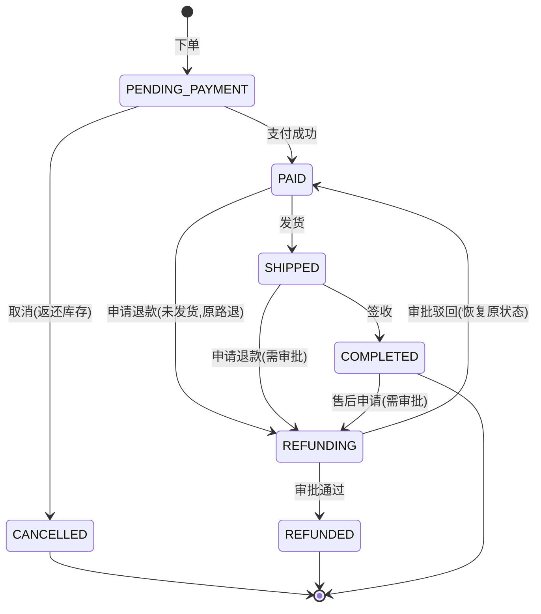

# 跨境电商智能订单助手 — 需求文档（PRD）

| 项目名 | cross-ecommerce-agent（跨境电商智能订单助手）  |
|-----|------------------------------------|
| 版本  | v1.0                               |
| 日期  | 2026-08-24                         |
| 定位  | 个人简历项目：展示「Agent 应用接入真实业务系统」的完整落地能力 |
| 状态  | 初稿                                 |

---

## 1. 项目背景

跨境电商卖家（面向北美/欧洲/东南亚市场）的客服与运营日常工作高度重复：

- 频繁查询订单状态、物流轨迹（国际运输链路长、环节多）
- 处理海外客户退款/退货，涉及多币种、汇率、时差
- 需要快速查询售后政策（关税、无理由退货、运费承担）
- 定期手工导数据做销售/退款率报表

本项目用**自然语言交互的 Agent** 承接这些操作，底层由 **PHP 业务系统**提供真实的数据模型、业务流程与校验规则。两层解耦、独立部署，模拟真实企业中的 AI 集成方式。

---

## 2. 项目目标

1. 交付一套可运行的**两层系统**：LangGraph Agent（自然语言入口）+ PHP 业务系统（订单/商品/客户/退款/报表/汇率）
2. 覆盖 **5 类 Agent 能力**：订单查询、物流跟踪、售后处理（含人工审批）、政策问答（RAG）、数据报表（异步任务）
3. 附赠工程化资产：鉴权、统一响应、审计日志、**本地一键部署脚本**、**30+ 条评测用例**
4. 通过本项目验证并展示：多代理编排、human-in-the-loop、MCP 协议、RAG 检索、异步任务解耦

---

## 3. 术语表

| 术语                      | 说明                                     |
|-------------------------|----------------------------------------|
| Agent                   | 基于 LLM 的智能体，本项目为 LangGraph 实现          |
| 工具调用 / function calling | Agent 调用外部 API 完成真实操作的能力               |
| MCP                     | Model Context Protocol，模型上下文协议，工具标准化接口 |
| human-in-the-loop       | 人机协同：关键操作（退款）需人工审批，Agent 暂停等待          |
| RAG                     | 检索增强生成：知识库检索 + 引用溯源                    |
| 状态机                     | 订单状态流转规则与合法转移矩阵                        |
| 异步任务                    | 慢操作（报表生成）走消息队列，Agent 轮询结果              |

---

## 4. 角色与用户故事

### 4.1 角色

| 角色     | 说明                   | 交互方式         |
|--------|----------------------|--------------|
| 客服运营人员 | 主要用户，通过对话完成查询与操作     | 自然语言（Agent）  |
| 管理员    | 审批退款、查看异步任务          | 极简审批页面 / API |
| 系统     | Agent、业务系统、队列 Worker | —            |

### 4.2 用户故事（US）

- **US-01** 作为客服，我想用自然语言查订单（单号/客户/状态/时间），这样不用登录后台翻页
- **US-02** 作为客服，我想跟踪订单物流轨迹，这样能及时答复海外客户
- **US-03** 作为客服，我想为客户申请退款，系统自动校验状态与金额并走审批，避免误操作
- **US-04** 作为管理员，我想审批退款申请，这样能控制资金风险
- **US-05** 作为客服，我想问售后政策（无理由退货期限、关税承担、运费规则），Agent 基于知识库回答并给出引用来源
- **US-06** 作为运营，我想让 Agent 生成月度销售/退款率报表，不用手动导数据
- **US-07** 作为客服，我想查商品库存与客户消费记录，便于处理咨询与客诉

---

## 5. 范围

### 5.1 本期包含

- **业务系统**：订单、商品、客户、退款、异步任务、汇率配置六大模块
- **Agent**：意图路由、工具调用、退款审批中断（interrupt）、RAG 政策问答、报表任务编排
- **MCP**：原生 PHP 实现的 MCP Server，向 Agent 暴露业务工具
- **工程化**：Token 鉴权、统一响应/错误码、状态流转与审计日志、本地一键部署脚本、评测集

### 5.2 明确不做（非目标，防范围膨胀）

- ❌ 不接真实支付网关（支付动作以接口模拟，直接标记已支付）
- ❌ 不接真实跨境平台 API（Amazon/Shopee/TikTok 等；物流轨迹用模拟数据）
- ❌ 不做多平台订单同步、WMS/ERP 集成
- ❌ 不做完整后台管理 UI（仅极简审批页 + API）
- ❌ 不做多租户、不做国际化多语言界面

---

## 6. 功能需求

> 优先级：P0 = 核心必须，P1 = 重要，P2 = 锦上添花

### 6.1 订单模块

| 编号    | 需求                                              | 优先级 | 验收要点                       |
|-------|-------------------------------------------------|-----|----------------------------|
| FR-01 | 下单：校验商品存在与库存，事务扣减库存，生成唯一订单号，金额按成交币种 + 汇率快照存储    | P0  | 并发下单库存不为负；订单号格式 `CE+日期+序号` |
| FR-02 | 订单查询：订单号/客户/状态/日期范围/币种 多条件组合 + 分页               | P0  | 空结果返回友好提示                  |
| FR-03 | 订单详情：商品明细、金额（原币种 + 折合 CNY）、收货地址、物流单号、状态时间线      | P0  | 时间线取自状态日志                  |
| FR-04 | 修改收货地址：仅 `PENDING_PAYMENT` / `PAID` 可改，写入地址变更日志 | P0  | 已发货订单返回 409 业务错误           |
| FR-05 | 取消订单：仅 `PENDING_PAYMENT` 可取消，返还库存               | P0  | 状态流转正确、库存回补                |
| FR-06 | 状态流转：按 7.1 状态机推进，所有流转写 `order_status_logs`      | P0  | 非法流转被拒绝                    |
| FR-07 | 物流跟踪：返回模拟物流时间线（揽收→国际干线→清关→派送→签收）                | P0  | 未发货返回空轨迹提示                 |

### 6.2 商品模块

| 编号    | 需求                     | 优先级 | 验收要点     |
|-------|------------------------|-----|----------|
| FR-08 | 商品查询：SKU / 关键词 / 状态 过滤 | P0  | —        |
| FR-09 | 库存查询与扣减/返还（与下单/取消同一事务） | P0  | 事务回滚测试通过 |

### 6.3 客户模块

| 编号    | 需求                                     | 优先级 | 验收要点      |
|-------|----------------------------------------|-----|-----------|
| FR-10 | 客户查询：ID / 邮箱 / 姓名，返回消费统计（订单数、总消费、币种偏好） | P0  | —         |
| FR-11 | 敏感字段脱敏：手机号中间四位打码，接口层统一处理               | P0  | 日志中也不出现明文 |

### 6.4 退款模块

| 编号    | 需求                                                         | 优先级 | 验收要点           |
|-------|------------------------------------------------------------|-----|----------------|
| FR-12 | 申请退款：校验订单状态与金额（≤ 实付），创建 `pending` 退款单                      | P0  | 非法状态返回 409 及原因 |
| FR-13 | 人工审批：approve / reject，通过后订单 `REFUNDING → REFUNDED`，驳回恢复原状态 | P0  | 审批动作写审计日志      |
| FR-14 | 防重复退款：同订单存在未完成（pending）申请时不可重复提交                           | P0  | 返回 409 业务错误    |
| FR-15 | 退款金额校验：不超过订单实付金额                                           | P0  | 超限被拒           |
| FR-16 | 退款单查询：单号 / 订单号 / 状态                                        | P1  | —              |

### 6.5 异步任务模块（报表/导出）

| 编号    | 需求                                                               | 优先级 | 验收要点     |
|-------|------------------------------------------------------------------|-----|----------|
| FR-17 | 创建任务：`type + params` 入队，返回 `task_no`，状态 `pending`                | P0  | 入队成功即返回  |
| FR-18 | 任务执行：Worker 消费消息，查询数据生成 CSV/摘要，更新状态                              | P0  | 结果可下载/可读 |
| FR-19 | 任务查询：按 task_no 轮询状态与结果摘要                                         | P0  | 失败返回错误原因 |
| FR-20 | 任务类型：`report:monthly_sales`、`report:refund_rate`、`export:orders` | P0  | 至少实现前两种  |

### 6.6 汇率模块

| 编号    | 需求                                     | 优先级 | 验收要点       |
|-------|----------------------------------------|-----|------------|
| FR-21 | 汇率配置：USD/EUR/GBP/JPY/SGD → CNY，订单存汇率快照 | P1  | 快照保证历史数据不变 |

### 6.7 Agent 能力

| 编号    | 需求                                                 | 优先级 | 验收要点             |
|-------|----------------------------------------------------|-----|------------------|
| FR-22 | 意图路由：查询 / 操作 / 知识问答 / 报表 四类意图分类                    | P0  | 分类准确率 ≥ 95%（评测集） |
| FR-23 | 工具调用：6.1~6.6 的业务操作全部暴露为工具，参数严格校验                   | P0  | 非法参数在进入业务系统前被拦截  |
| FR-24 | human-in-the-loop：退款审批使用 LangGraph interrupt 暂停/恢复 | P0  | 审批前后对话上下文不丢失     |

**FR-24 实现说明：退款审批的两种落地形态（2026-09-01 决策）**

- **方案 A（过渡形态，M3 演示用）**：Agent 提交退款后调用 LangGraph `interrupt()` 暂停图执行，等管理员确认；`Command(resume=...)` 恢复后查询审批结果并回复用户。优点：链路短、闭环直观；缺点：进程需长挂起，依赖服务端保存 `thread_id` 与恢复通道，超时/重启场景脆弱
- **方案 B（生产形态，目标架构）**：Agent 提交退款后**不挂起**，立即回复"已提交，待管理员审批"；管理员在 Laravel 后台走既有审批接口（approve / reject）；审批结果通过 **RabbitMQ 事件**推送，Agent 订阅事件后异步回复用户（审批通过/驳回）。优点：无长挂起、天然抗超时/重启、与业务系统既有审批流统一，避免双重审批
- **决策（2026-09-01 更新）**：方案 B 已落地 —— Laravel 审批后发 RabbitMQ `refund_events` 事件（RefundEventPublisher），Agent 提交退款后不挂起（第二个 interrupt 已移除），`refund_consumer.py` 订阅事件异步通知（详见架构文档 §7.3.1）；第一个确认中断（refund_confirm）保留
| FR-25 | RAG 政策问答：检索售后政策文档并回答，回答带引用来源 | P0 | 引用可追溯到原文片段 |
| FR-26 | 结果规范化：金额、状态、时间等以结构化摘要输出 | P1 | — |
| FR-27 | 兜底与澄清：工具返回空/异常时引导用户换条件，不编造数据 | P0 | 无结果时明确说"未查到" |
| FR-28 | 上下文记忆：会话内多轮追问（如"那物流呢"）与跨会话用户上下文 | P1 | — |

**FR-28 实现说明：会话记忆与长会话摘要**

- **短期记忆**：LangGraph checkpointer（PostgreSQL）按 `thread_id` 持久化全部对话消息，多轮追问、进程重启均不丢失；不同会话隔离
- **上下文控制（方案 A）**：LLM 输入仅携带最近 N 轮消息（如最近 10 条），控制 token 成本，state 中仍保留全量历史
- **长会话摘要（方案 B）**：当历史超过阈值时，将更早的消息由 LLM 压缩为摘要（保留订单号、金额、用户诉求、未决事项等关键信息），LLM 输入结构变为：`system + 摘要 + 最近 N 轮 + 当前问题`
- **验收**：50 轮以上的长会话，单轮 LLM 输入 token 不随轮次线性增长；摘要后用户关键诉求（订单号/退款金额）仍可被正确回答

### 6.8 非功能需求

| 编号    | 需求                                         | 优先级 | 验收要点           |
|-------|--------------------------------------------|-----|----------------|
| FR-29 | 统一响应：`{code, message, data}` + 错误码表        | P0  | 见架构文档 6.3      |
| FR-30 | 鉴权：业务 API 使用 Token；Agent 与审批端分离权限          | P0  | 无 Token 一律 401 |
| FR-31 | 性能：常规查询 API P95 < 500ms；Agent 工具调用 10s 内返回 | P1  | 压测脚本验证         |
| FR-32 | 日志与审计：请求日志、状态流转日志、审批日志、Agent 追踪（LangSmith） | P0  | 关键操作可追溯        |
| FR-33 | 数据造数：Seeder 生成 100+ 订单，覆盖全部状态、5 种币种、8+ 国家  | P0  | —              |

---

## 7. 业务规则

### 7.1 订单状态机

> 说明：物流状态（PENDING / IN_TRANSIT / IN_CUSTOMS / OUT_FOR_DELIVERY / DELIVERED）是独立维度字段，不参与订单状态机，避免状态爆炸。

### 7.2 操作 × 状态 允许矩阵

| 操作   | PENDING_PAYMENT | PAID   | SHIPPED | COMPLETED | REFUNDING | 其他 |
|------|-----------------|--------|---------|-----------|-----------|----|
| 改地址  | ✅               | ✅      | ❌       | ❌         | ❌         | ❌  |
| 取消订单 | ✅               | ❌      | ❌       | ❌         | ❌         | ❌  |
| 申请退款 | ❌               | ✅（原路退） | ✅（需审批）  | ✅（售后，需审批） | ❌         | ❌  |
| 审批退款 | —               | —      | —       | —         | ✅         | —  |

### 7.3 其他规则

- 退款金额 ≤ 订单实付金额（实付 = 总金额 - 已退金额）
- 同订单存在 `pending` 退款单时禁止重复申请
- 订单金额以成交币种存储，同时存 `exchange_rate` 快照；统计类接口返回折合 CNY
- 所有状态流转必须经过业务层校验（Agent 无绕过权限）

---

## 8. 数据需求

核心实体：`users`、`customers`、`products`、`orders`、`order_items`、`order_status_logs`、`refunds`、`tasks`、`exchange_rates`（表结构见架构文档 §5）。

造数分布（Seeder）：

| 数据  | 规模   | 覆盖                                |
|-----|------|-----------------------------------|
| 商品  | 30+  | 5 个类目，含下架商品                       |
| 客户  | 20+  | 8+ 国家（美/英/德/日/新加坡等）               |
| 订单  | 100+ | 全部状态、5 币种、跨 6 个月时间分布              |
| 退款单 | 15+  | pending / approved / rejected 各状态 |
| 汇率  | 5 条  | USD/EUR/GBP/JPY/SGD               |

---

## 9. 验收标准

### 9.1 功能验收

- 6.1~6.8 中所有 P0 项全部通过，P1 项 ≥ 80% 通过
- 状态机非法流转、重复退款、超限退款等负向用例全部被拦截
- Agent 端 5 类能力均可演示（准备演示脚本）

### 9.2 评测集（核心验收）

- 规模：**30+ 条自然语言用例**，分类如下：

| 类别        | 用例数 | 示例                                      |
|-----------|-----|-----------------------------------------|
| 订单查询      | 8   | "查一下 CE20260615001 的订单"、"最近一周已发货的订单有哪些" |
| 物流跟踪      | 4   | "订单 CE20260702088 到哪了"                  |
| 退款/售后     | 6   | "帮我把订单 CE20260710033 退款，理由是尺寸不合适"       |
| 政策问答（RAG） | 6   | "发美国关税谁承担？"、"支持 7 天无理由退货吗"              |
| 报表任务      | 4   | "生成 6 月销售报表"、"上个月退款率多少"                 |
| 边界/异常     | 6   | 不存在的订单号、已发货改地址、重复退款、无权限操作、空结果查询         |

- **通过标准**：正确率 ≥ 90%；关键负向用例（编造数据、非法操作）100% 被拦截
- 评测方式：离线脚本跑用例 → 人工核对 → 记录通过率（可配合 LangSmith 追踪）

---

## 11. 里程碑

| 阶段          | 周期    | 交付物                                                        |
|-------------|-------|------------------------------------------------------------|
| M1 业务系统地基   | 第 1 周 | Laravel 项目 + 数据模型 + Seeder + 基础 CRUD API + Token 鉴权 + 统一响应 |
| M2 业务闭环     | 第 2 周 | 订单状态机 + 退款流程 + 队列 Worker + 异步报表 + 审批页                      |
| M3 Agent 集成 | 第 3 周 | MCP Server（原生 PHP）+ LangGraph 多代理（路由/工具/interrupt）+ RAG    |
| M4 工程化收尾    | 第 4 周 | 评测集 + 本地部署脚本 + README 架构文档 + 演示脚本                          |

---

## 12. 风险与对策

| 风险                | 影响       | 对策                                  |
|-------------------|----------|-------------------------------------|
| LLM 输出不稳定（幻觉/格式错） | 误操作或错误回答 | 结构化输出 + 工具参数强校验 + 负向用例拦截 + 关键操作人工审批 |
| 模拟数据可信度不足         | 演示效果打折   | Seeder 精心造数（真实感字段、合理分布）             |
| 范围膨胀              | 延期       | 严格执行 5.2 非目标清单                      |
| Agent 与业务系统耦合过深   | 可维护性差    | 强制只通过工具层/MCP 访问，业务系统不感知 AI          |
